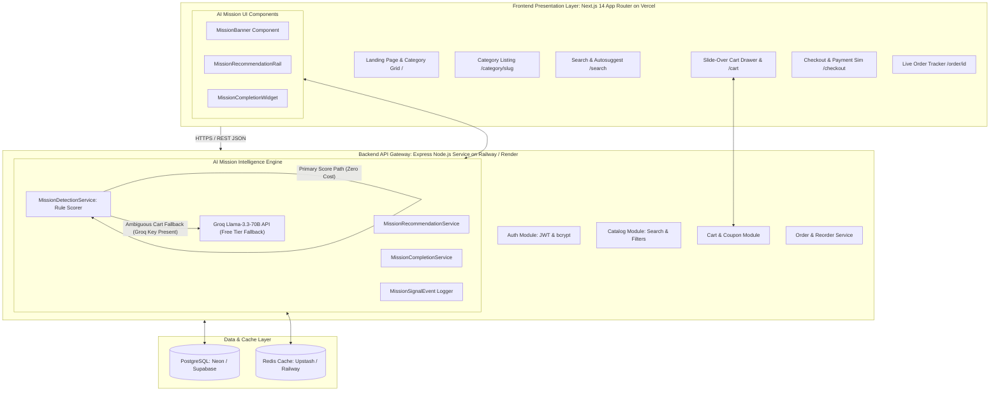
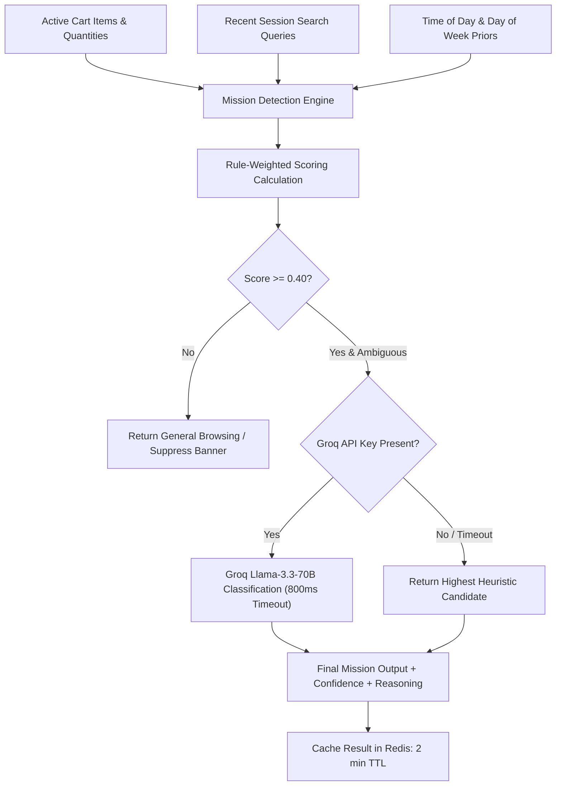

# Architecture Document — BlinkClone: Quick Commerce Platform with AI Mission Intelligence

This document describes the end-to-end multi-tier system architecture for the **BlinkClone Quick Commerce Platform with AI Mission Intelligence**. It is derived directly from [context.md](file:///c:/Nextleap%20Projects%20Git/PMFGPMVP/docs/context.md), [problemstatement.md](file:///c:/Nextleap%20Projects%20Git/PMFGPMVP/docs/problemstatement.md), [implementation_plan.md](file:///c:/Nextleap%20Projects%20Git/PMFGPMVP/docs/implementation_plan.md), and [edge-case.md](file:///c:/Nextleap%20Projects%20Git/PMFGPMVP/docs/edge-case.md).

---

## 1. Executive Architecture Summary & Design Goals

The platform is designed as an intent-driven quick-commerce architecture combining high-speed catalog & order management with an **AI Mission Intelligence Engine**:

* **Frontend Presentation Layer (Vercel):** Next.js 14 App Router React application delivering SSR product exploration, real-time Zustand cart state synchronization, optimistic UI updates, and reactive mission widgets (`MissionBanner`, `MissionRecommendationRail`, `MissionCompletionWidget`).
* **Backend API Gateway & Commerce Services (Railway / Render):** Modular Express API processing JWT authentication, catalog search/filtering, cart CRUD, simulated checkout, and timer-based order status lifecycle management.
* **AI Mission Intelligence Engine (Hybrid AI Layer):** Hybrid intelligence module running a local deterministic rule-weighted scoring algorithm as its primary zero-cost path, coupled with an optional **Groq Cloud API** (`llama-3.3-70b-versatile`) for classification on ambiguous carts, backed by Redis session caching.
* **Data & Cache Layer (Neon / Supabase / Upstash):** Managed PostgreSQL relational store enforcing transactional data integrity for users, catalog, cart, and orders, paired with a Redis in-memory cache for ultra-fast session reads and debounced mission computations.

---

## 2. End-to-End System Architecture



---

## 3. Tech Stack (100% Free Tier Ecosystem)

| Layer | Technology | Free Tier / Zero-Cost Provider | Rationale |
|---|---|---|---|
| Frontend Framework | Next.js 14 (App Router) + React 18 + TypeScript | Open Source | SSR for fast product pages, file-based routing, native Vercel integration |
| Styling | Tailwind CSS | Open Source | Rapid, consistent UI matching Blinkit's dense grid layouts |
| Client State | Zustand | Open Source | Lightweight cart/session state management |
| Data Fetching | TanStack Query (React Query) | Open Source | Caching, refetching, optimistic UI for cart actions |
| Backend Framework | Node.js + Express + TypeScript | Open Source | Simple REST API, lightweight containerization |
| ORM | Prisma | Open Source | Type-safe DB access, auto migrations |
| Database | PostgreSQL | Neon Postgres / Supabase / Railway (Free Tier) | Relational integrity for orders/inventory/users |
| Cache/Session | Redis | Upstash Redis / Railway Redis (Free Tier) | Serverless/in-memory cart session cache & mission score cache |
| Auth | JWT + bcrypt | Open Source | Stateless auth, zero third-party subscription costs |
| AI Mission Layer | Rule Scorer + **Groq Cloud API** (`llama-3.3-70b-versatile`) | **Groq Free API Key** (console.groq.com) | 100% free tier LLM inference (sub-500ms) + local deterministic fallback |
| Frontend Hosting | Vercel | Vercel Free Hobby Tier | Native Next.js support, instant Git CI/CD |
| Backend Hosting | Railway / Render | Railway Free / Render Free Tier | Simple container deploy, free environment variables |
| CI/CD | GitHub Actions | GitHub Free Tier | Auto-build & deploy workflows |

---

## 4. System Components & Modular Monorepo Architecture

### 4.1 Frontend Presentation Components (`apps/frontend`)

* **Routes:** `/`, `/category/[slug]`, `/search`, `/product/[id]`, `/cart`, `/checkout`, `/order/[id]`, `/orders`, `/login`, `/signup`.
* **State Management:** Zustand cart store (`cartStore.ts`) managing optimistic additions, stepper increments, and instant drawer opens; TanStack Query handling caching and server state reconciliation.
* **AI Components:**
  * `MissionBanner`: Notifies user of inferred intent (*"Looks like you're planning Breakfast 🍳"*).
  * `MissionRecommendationRail`: Intent-driven complementary product carousel replacing generic recommendations.
  * `MissionCompletionWidget`: Live percentage progress bar inside Cart & Checkout with 1-tap add chips.

### 4.2 Backend API Services (`apps/backend`)

Modular monolith structure designed for microservice decomposition:

* **Auth Service:** User registration, password hashing (bcrypt), login, JWT token issuance & validation middleware.
* **Catalog Service:** Category tree retrieval, product listing with multi-parameter filtering, full-text ILIKE search, and product details.
* **Cart Service:** Session/User cart CRUD, quantity bounds enforcement (1–10 units), coupon application logic (`MISSION20`, `WELCOME100`).
* **Order Service:** Checkout order creation with idempotency header guards, timer-based order status lifecycle simulation (`Placed` → `Packed` → `Out for Delivery` → `Delivered`), and historical one-tap reordering.
* **AI Mission Intelligence Engine:**
  * `MissionDetectionService`: Evaluates cart category ratios, search history logs, and time-of-day priors. Calls Groq API for tie-breaker reasoning if confidence is close.
  * `MissionRecommendationService`: Queries complementary products matching active mission tags, filtering out already-selected cart subcategories.
  * `MissionCompletionService`: Evaluates cart contents against target mission checklists to calculate completion percentage and surface top 3 missing item chips.

---

## 5. AI Mission Intelligence Engine — Hybrid Design & Consensus



---

## 6. Seed Data Taxonomy (Locked 10 Categories)

The catalog is built on **10 locked top-level categories** and **30 subcategories** (~450–600 seeded products):

| # | Category | Subcategories | Primary Mission Tags |
|---|---|---|---|
| 1 | **Fruits & Vegetables** | Fresh Fruits, Fresh Vegetables, Herbs & Seasonings | `breakfast`, `dinner_prep`, `monthly_grocery` |
| 2 | **Dairy & Breakfast** | Milk & Curd, Eggs & Paneer, Breakfast Cereals | `breakfast`, `monthly_grocery` |
| 3 | **Bakery & Biscuits** | Bread & Buns, Cookies & Biscuits, Cakes & Rusks | `breakfast`, `movie_night`, `office_snacks` |
| 4 | **Munchies & Snacks** | Chips & Namkeen, Chocolates, Frozen Snacks | `movie_night`, `office_snacks`, `guest_arrival` |
| 5 | **Cold Drinks, Tea & Coffee** | Soft Drinks & Juices, Tea & Coffee, Health Drinks | `breakfast`, `movie_night`, `guest_arrival` |
| 6 | **Atta, Rice, Dal & Masala** | Flours & Grains, Pulses & Dal, Spices & Oils | `dinner_prep`, `monthly_grocery` |
| 7 | **Cleaning Essentials** | Detergents, Cleaners & Fresheners, Disposables | `house_cleaning`, `monthly_grocery` |
| 8 | **Personal Care** | Bath & Body, Oral Care, Skin & Hair Care | `monthly_grocery`, `emergency_purchase` |
| 9 | **Baby Care** | Diapers & Wipes, Baby Food, Baby Skin Care | `baby_care` |
| 10 | **Pet Care** | Pet Food, Pet Hygiene, Pet Accessories | `pet_care` |

---

## 7. Data Schema & Entity Relationships

```
User (1) ───< Address (N)
User (1) ───< Cart (N) ───< CartItem (N) >─── Product (1) >── Category (1)
User (1) ───< Order (N) ───< OrderItem (N) >── Product (1)
Mission (1) ─── Lookup Checklist Categories
MissionSignalEvent (N) ─── Logging Search & Viewing Events per Session
```

---

## 8. Cross-Document Traceability

* [problemstatement.md](file:///c:/Nextleap%20Projects%20Git/PMFGPMVP/docs/problemstatement.md) — Product vision, goals, and 3 core problem definitions.
* [context.md](file:///c:/Nextleap%20Projects%20Git/PMFGPMVP/docs/context.md) — User personas, scope boundaries, and side-by-side user flow diagrams.
* [implementation_plan.md](file:///c:/Nextleap%20Projects%20Git/PMFGPMVP/docs/implementation_plan.md) — Phased build roadmap and file-by-file implementation breakdown.
* [edge-case.md](file:///c:/Nextleap%20Projects%20Git/PMFGPMVP/docs/edge-case.md) — Comprehensive resilience specification, race condition guards, and Groq fallback behavior.
