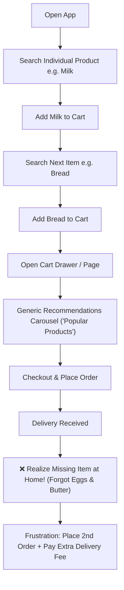
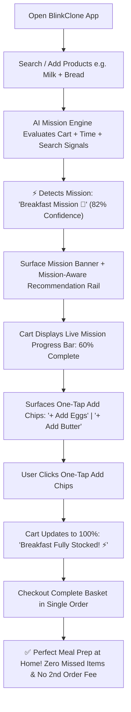

# Context Document — BlinkClone: Quick Commerce Platform with AI Mission Intelligence

## 1. Executive Summary & Vision

**BlinkClone** is a full-stack, deployable quick-commerce web application inspired by India's 10-15 minute grocery delivery platforms (such as Blinkit). Beyond replicating the end-to-end shopping journey (browse, search, cart, checkout, order tracking, and reorder), the platform introduces an innovative **AI Mission Intelligence Layer**.

Standard quick-commerce apps are **reactive**—they respond to specific search queries or display generic recommendations, but fail to understand the underlying context or goal ("mission") driving the user's shopping session. BlinkClone bridges this gap by inferring user intent (e.g., preparing breakfast, hosting guests, monthly restocking) and providing real-time mission progress, complementary suggestions, and one-tap completion tools.

---

## 2. Background & Problem Statement

### 2.1 The Quick-Commerce Gap
Urban consumers rely heavily on 10–15 minute grocery delivery apps for speed and convenience. However, existing platforms treat carts purely as independent items rather than goal-oriented bundles:
- **Reactive vs. Intent-Aware:** A cart containing milk, bread, and eggs at 7:00 AM clearly indicates "Breakfast Prep," yet standard apps treat it identically to an afternoon snack purchase.
- **Three Core Problems Identified:**
  1. **Missed Needs:** Users frequently forget essential complementary items (e.g., buying pasta but forgetting sauce or parmesan cheese), leading to repeat orders, extra delivery fees, or incomplete meals.
  2. **Generic Recommendations:** "Frequently Bought Together" or "Similar Products" widgets use naive co-occurrence stats or static merchandising, missing real-time context (time of day, day of week, search recency).
  3. **Lack of Progress Visibility:** Users have no indicator showing if their cart is complete for their intent until they run out of items at home.

---

## 2.2 User Flow Comparison: Traditional ("Actual") vs. BlinkClone AI ("Now")

### 🔴 Traditional Quick-Commerce Flow ("Actual") — Reactive & Fragmented

### 🟢 BlinkClone AI Mission Flow ("Now") — Intent-Driven & Complete

---

## 3. Core Project Objectives

1. **Functional Quick-Commerce Clone:** Deliver a fully interactive, production-deployed web application covering the end-to-end Blinkit consumer experience with zero dead-end CTAs.
2. **AI Mission Intelligence Integration:**
   - **Mission Detection:** Detect user intent with confidence scoring using cart items, search history, time/day signals, and user profile data.
   - **Smart Mission Discovery:** Replace generic recommendations with cross-category, mission-relevant complementary products.
   - **Mission Completion Assistant:** Provide a dynamic progress indicator (e.g., "Breakfast Mission — 82% complete") with one-tap add suggestions to fill missing category slots.
3. **Deployable Full-Stack MVP:** Host a frontend on Vercel and backend/database on Railway, fully wired end-to-end.

---

## 4. Target User Personas

| Persona | Description | Primary Needs |
|---|---|---|
| **Daily Shopper** | Orders small baskets multiple times a week (milk, snacks, veggies). | Speed, friction-free reordering, instant cart updates. |
| **Weekly / Monthly Planner** | Conducts large restocking runs for house essentials. | Basket completeness checks, avoiding missed items. |
| **Occasion Shopper** | Buys for specific events (hosting guests, movie night, festival). | Curated product bundles, reduced manual browsing. |
| **New Parent / Pet Owner** | Has recurring, mission-critical needs (baby care, pet supplies). | Low-effort, predictable restocking workflows. |

---

## 5. MVP Scope Boundaries

### 5.1 In-Scope (MVP)

#### Core Quick-Commerce Features
- **Landing & Discovery:** Banners, category grids, product carousels.
- **Catalog Browsing:** Grid & list views across **10 top-level categories and 30 subcategories** (~450–600 seeded products).
- **Search & Filter:** Product search with real-time autosuggest and multi-parameter filtering/sorting.
- **Product Details:** Detailed view (images, price, MRP, unit, stock status, description, "Add to Cart").
- **Cart Management:** Global slide-over cart drawer and full `/cart` page with dynamic quantity controls (+/-), delivery ETA simulation, and coupon application.
- **Checkout & Orders:** Address selection, simulated delivery slot, order summary, mocked payment flow, order confirmation, order history, and one-tap reorder.
- **Authentication:** User registration, login, JWT session persistence.
- **Interactive UI:** Every CTA (Add, Increment/Decrement, Wishlist, Filter, Coupon, Place Order, Track, Reorder) must be fully functional.

#### AI Mission Intelligence Platform
- **Mission Detection Engine:** Heuristic/rule-based scoring algorithm + time/day priors (with optional Groq LLM API tie-breaker call using Llama-3.3-70B via **Groq's 100% Free API Tier**) producing normalized confidence scores (0.0–1.0). Zero API cost is maintained via local heuristic scoring fallback.
- **Smart Mission Discovery:** Intent-driven product recommendation rail displaying cross-category items relevant to the active mission.
- **Mission Completion Assistant:** Dynamic percentage checklist indicator inside cart & checkout with top missing item chips for one-tap cart addition.

#### Hosting & Deployment (100% Free Tier Ecosystem)
- **Frontend:** Next.js deployed on Vercel (Free Hobby Tier).
- **Backend:** Node.js/Express API deployed on Railway or Render (Free Tier).
- **Data Persistence:** Managed PostgreSQL (Neon / Supabase / Railway Free Tier) & Redis (Upstash / Railway Free Tier).

---

## 5.2 Out-of-Scope (MVP)

- **Real Payment Processing:** Payments are simulated/mocked for MVP testing.
- **GPS / Live Rider Tracking:** Delivery tracking uses timer-based status simulation (Placed → Packed → Out for Delivery → Delivered).
- **Multi-Warehouse / Dark Store Logistics:** Single simulated inventory pool.
- **Native Mobile Apps:** Web application only (responsive for mobile browsers).
- **SMS / Real OTP Auth:** Mocked OTP / standard JWT email & password authentication.
- **Heavy Custom ML Model Training:** High-throughput ML training pipelines are excluded; deterministic heuristic scoring + optional LLM API fallback is used.

---

## 6. AI Mission Intelligence Architecture

### 6.1 Supported Missions & Detection Signals
The platform infers from 12 canonical shopping missions:
- **Primary Missions:** Breakfast, Dinner Prep, Monthly Grocery, House Cleaning, Baby Care, Pet Care.
- **Cross-Category Missions:** Movie Night, Office Snacks, Festival Shopping, Gym Nutrition, Emergency Purchase, Guest Arrival.

**Detection Input Signals:**
1. Active cart item tags & category representation
2. Recent search query terms (session-scoped)
3. Time of day & day of week
4. User historical order categories
5. Season/festival calendar events

### 6.2 Mission Completion Logic
For a detected mission (e.g., *Breakfast*):
1. The engine checks required category slots: `{ Dairy, Bakery/Bread, Eggs/Protein, Beverage, Spreads/Preserves }`.
2. Compares active cart categories against the checklist to compute completion percentage (e.g., 4 out of 5 slots = 80%).
3. Recommends items from missing slots directly into the cart completion widget.

---

## 7. Seed Data Taxonomy (Locked)

The catalog is built on 10 locked top-level categories and 30 subcategories:

| # | Category Name | Subcategories | Primary Mission Tags |
|---|---|---|---|
| 1 | **Fruits & Vegetables** | Fresh Fruits, Fresh Vegetables, Herbs & Seasonings | `breakfast`, `dinner_prep`, `monthly_grocery` |
| 2 | **Dairy & Breakfast** | Milk & Curd, Eggs & Paneer, Breakfast Cereals | `breakfast`, `monthly_grocery` |
| 3 | **Bakery & Biscuits** | Bread & Buns, Cookies & Biscuits, Cakes & Rusks | `breakfast`, `movie_night`, `office_snacks` |
| 4 | **Munchies & Snacks** | Chips & Namkeen, Chocolates, Frozen Snacks | `movie_night`, `office_snacks`, `guest_arrival` |
| 5 | **Cold Drinks, Tea & Coffee** | Soft Drinks & Juices, Tea & Coffee, Health Drinks | `breakfast`, `movie_night`, `guest_arrival` |
| 6 | **Atta, Rice, Dal & Masala** | Flours & Grains, Pulses & Dal, Spices & Oils | `dinner_prep`, `monthly_grocery` |
| 7 | **Cleaning Essentials** | Detergents, Cleaners & Fresheners, Disposables | `house_cleaning`, `monthly_grocery` |
| 8 | **Personal Care** | Bath & Body, Oral Care, Skin & Hair Care | `monthly_grocery`, `emergency_purchase` |
| 9 | **Baby Care** | Diapers & Wipes, Baby Food, Baby Skin Care | `baby_care` |
| 10 | **Pet Care** | Pet Food, Pet Hygiene, Pet Accessories | `pet_care` |

---

## 8. Key Success Criteria

1. **Complete E2E User Journey:** User can register/login, browse/search, add items, see active mission detection & recommendations, complete checkout, and reorder from history without encountering broken CTAs or unhandled states.
2. **Accurate Mission Detection:** Mission Detection Engine accurately classifies standard test carts (e.g., Breakfast, Dinner Prep, Monthly Grocery) with clear confidence scores displayed in the UI.
3. **Dynamic Mission Completion Widget:** Dynamic completion % updates instantly on cart mutations with at least 3 one-tap add suggestions.
4. **Live Production Deployment:** App is accessible via public URLs (Vercel frontend talking to Railway backend/Postgres/Redis) with clean CORS and environment configuration.
