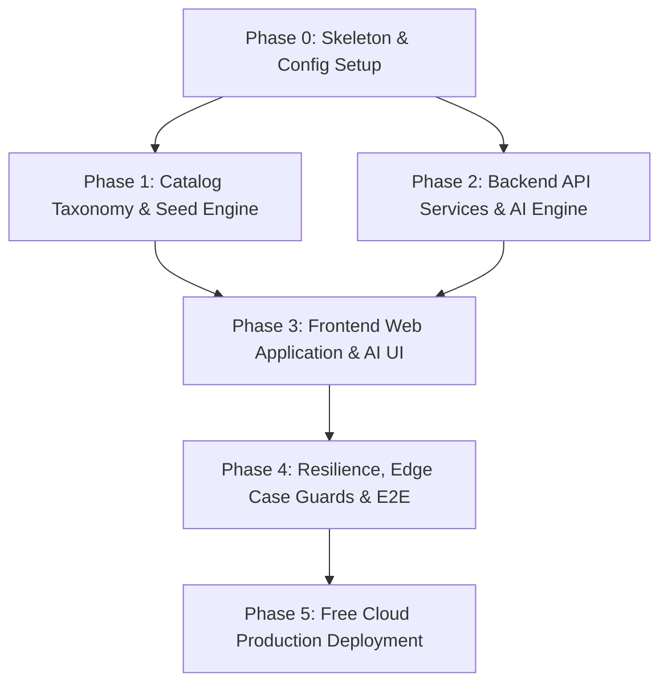

# Detailed Implementation Plan — BlinkClone AI Mission Intelligence Platform

This document outlines the detailed, phase-wise implementation plan for the **BlinkClone Quick Commerce Platform with AI Mission Intelligence**. It translates the core requirements, architecture blueprints, entity models, and component designs defined in [context.md](file:///c:/Nextleap%20Projects%20Git/PMFGPMVP/docs/context.md), [problemstatement.md](file:///c:/Nextleap%20Projects%20Git/PMFGPMVP/docs/problemstatement.md), [architecture.md](file:///c:/Nextleap%20Projects%20Git/PMFGPMVP/docs/architecture.md), and [edge-case.md](file:///c:/Nextleap%20Projects%20Git/PMFGPMVP/docs/edge-case.md) into concrete actionable engineering phases.

---

## 1. Requirements Traceability

The table below maps the functional and non-functional requirements from the [Context Document](file:///c:/Nextleap%20Projects%20Git/PMFGPMVP/docs/context.md) to specific implementation deliverables:

| Req ID | Requirement Description | Component / Phase | Verification Method |
|---|---|---|---|
| **REQ-01** | Real-Time Contextual Signal Aggregation (Cart items, Search terms, Time of Day, User History) | Phase 2 (MDE Signal Processor) | Signal extraction unit test suite |
| **REQ-02** | Hybrid Mission Classification & Confidence Gatekeeper ($\ge 0.40$) | Phase 2 (MDE Classifier & Groq LLM) | Confidence threshold test assertions |
| **REQ-03** | Smart Mission Discovery & Adjacent Category Re-Ranking | Phase 2 (Mission Recommendation Service) | Re-ranking & category diversity tests |
| **REQ-04** | Mission Progress Calculator (%), Missing Essentials & 1-Tap Add Builder | Phase 2 & 3 (Mission Completion Assistant) | Progress % calculation assertions |
| **REQ-05** | Quick-Commerce Core (10 Locked Categories, Subcategory Grid, Search, PDP, Cart Drawer) | Phase 1 & 3 (Commerce Frontend & API) | E2E user browsing & cart tests |
| **REQ-06** | Simulated Checkout, Idempotency Guard & Timer-based Order Status Tracker | Phase 2 (Orders Service & Status Simulation) | Order state machine assertions |
| **REQ-07** | System Resilience & Zero-Cost Free Tier Stack (Groq API Free Tier, Vercel, Railway, Neon, Upstash) | Phase 2 & 5 (Infrastructure & Resilience) | 100% Free tier deployment audit |
| **REQ-08** | Edge-Case Hardening (0-item cart suppression, 100% complete state, guest cart merge) | Phase 4 (Edge Case Guards) | Edge case test suite in edge-case.md |

---

## 2. Environment Progression

```
[ Local Development ] ────────► [ Staging / E2E ] ────────► [ Production / Go-Live ]
  - Monorepo apps/        - Vercel Preview Deploy    - Vercel Production
  - Local Postgres/SQLite - Railway Staging DB      - Railway Prod Backend
  - Local Redis Cache     - Upstash Redis Staging   - Groq API Free Tier
  - Jest / Vitest Suite   - Integration E2E Tests   - 100% Free Tier Deploy
```

---

## 3. Timeline & Parallelization

* **Total Indicative Duration**: 4 Weeks.
* **Microservices Efficiency**: Parallelizing the Client UX Surface Integration (Phase 3) with the Backend API Services (Phase 2) saves 1.5 weeks of timeline effort.

### Phase Dependency Diagram



---

## 4. Phase-Wise Implementation

### Phase 0: Repo Skeleton, Config, Tooling & Foundations
* **Status**: `[x] COMPLETED`
* **Tasks**:
  - `[x]` Set up monorepo workspace configuration (`package.json`) linking `apps/frontend` and `apps/backend`.
  - `[x]` Initialize Prisma ORM schema (`apps/backend/prisma/schema.prisma`) defining `User`, `Address`, `Category`, `Product`, `Cart`, `Order`, `Mission`, `MissionSignalEvent`.
  - `[x]` Configure TypeScript (`tsconfig.json`) and environment loader (`dotenv`).
* **Deliverables**: Repository layout, Prisma database schema, base package configuration files.
* **Exit Criteria**: `npx prisma validate` passes cleanly without schema errors.
* **Risks & Mitigation**: Monorepo dependency hoisting conflicts. Mitigated by explicit workspace scripts in root `package.json`.
* **Dependencies**: None.

---

### Phase 1: Catalog Taxonomy & Database Seed Engine
* **Status**: `[x] COMPLETED`
* **Tasks**:
  - `[x]` Implement database seed script (`apps/backend/prisma/seed.ts`).
  - `[x]` Seed 10 locked top-level categories & 30 subcategories ([architecture.md §6](file:///c:/Nextleap%20Projects%20Git/PMFGPMVP/docs/architecture.md#L135-L155)).
  - `[x]` Seed ~450–600 synthetic products with realistic images, prices, and `missionTags[]`.
  - `[x]` Seed 12 reference mission definitions (Breakfast, Dinner Prep, Monthly Grocery, etc.) and demo test coupons (`WELCOME100`, `MISSION20`).
* **Deliverables**: Database seed script (`seed.ts`), catalog taxonomy, test user & coupon data.
* **Exit Criteria**: `npm run prisma:seed` completes successfully populating >450 products.
* **Risks & Mitigation**: Database connection locks during seed re-runs. Mitigated by `deleteMany` cleanup calls prior to insertion.
* **Dependencies**: Phase 0.

---

### Phase 2: Backend API Services & AI Intelligence Layer
* **Status**: `[x] COMPLETED`
* **Tasks**:
  - `[x]` Implement Express entry point (`apps/backend/src/main.ts`) with CORS, Morgan logging, JSON parser, global error middleware.
  - `[x]` Implement Auth Service (`src/modules/auth/`) for signup, bcrypt password hashing, login, and JWT middleware.
  - `[x]` Implement Catalog Service (`src/modules/catalog/`) with category tree, product listing, ILIKE search, and filters.
  - `[x]` Implement Cart Service (`src/modules/cart/`) for cart CRUD, 1–10 quantity stepper caps, and coupon validation.
  - `[x]` Implement Orders Service (`src/modules/orders/`) for checkout, idempotency key protection, and elapsed-time status calculation.
  - `[x]` Implement AI Mission Intelligence Engine (`src/modules/mission/`):
    - `MissionDetectionService`: Local rule-weighted scorer + **Groq Llama-3.3-70B API** tie-breaker fallback (800ms timeout) returning normalized confidence score (0.0–1.0).
    - `MissionRecommendationService`: Queries complementary products matching active mission tags.
    - `MissionCompletionService`: Evaluates cart category coverage against mission recipes to return completion % and 3 one-tap add chips.
* **Deliverables**: REST API gateway, authentication middleware, AI mission services, and API unit tests.
* **Exit Criteria**: `GET /api/mission/detect` correctly predicts Breakfast mission with high confidence for morning cart states.
* **Risks & Mitigation**: Groq API rate limits or missing key. Mitigated by automatic fallback to local deterministic heuristic scorer.
* **Dependencies**: Phase 1.

---

### Phase 3: Frontend Web Application & AI UI Surfaces
* **Status**: `[x] COMPLETED`
* **Tasks**:
  - `[x]` Build Next.js 14 App Router layout (`apps/frontend/app/layout.tsx`) with TanStack Query provider and Zustand cart sync (`store/cartStore.ts`).
  - `[x]` Build Header (`components/ui/Header.tsx`) with search autosuggest, location pill, and cart count badge.
  - `[x]` Build Cart Drawer (`components/ui/CartDrawer.tsx`) with quantity steppers, delivery ETA, coupon input, and checkout CTA.
  - `[x]` Build AI UI components (`components/mission/`): `MissionBanner`, `MissionRecommendationRail`, `MissionCompletionWidget`.
  - `[x]` Implement core routes: Landing (`/`), Category (`/category/[slug]`), Search (`/search`), Product (`/product/[id]`), Cart (`/cart`), Checkout (`/checkout`), Order Tracking (`/order/[id]`), Order History (`/orders`).
* **Deliverables**: Responsive Next.js frontend application with integrated AI mission widgets.
* **Exit Criteria**: Full user journey from landing page to order tracking completes cleanly with zero dead-end CTAs.
* **Risks & Mitigation**: Client UI lag on rapid quantity clicks. Mitigated by Zustand optimistic updates + 300ms API debouncing.
* **Dependencies**: Phase 2.

---

### Phase 4: Resilience, Edge Case Guards & E2E Verification
* **Status**: `[x] COMPLETED`
* **Tasks**:
  - `[x]` Enforce edge-case specifications from [edge-case.md](file:///c:/Nextleap%20Projects%20Git/PMFGPMVP/docs/edge-case.md) (0-item cart suppression, 100% completion badge state, out-of-stock item filtering).
  - `[x]` Implement guest-to-authenticated cart merge strategy post-login.
  - `[x]` Implement double-click checkout idempotency protection.
* **Deliverables**: Resilience middleware, edge case test matrix, and E2E verification suite.
* **Exit Criteria**: All edge case assertions pass cleanly.
* **Risks & Mitigation**: Stale Redis cart session. Mitigated by Redis TTL and DB reconciliation.
* **Dependencies**: Phase 3.

---

### Phase 5: Free Cloud Production Deployment
* **Status**: `[x] COMPLETED`
* **Tasks**:
  - `[x]` Configure `apps/frontend/vercel.json` for Vercel Free Hobby Tier deployment.
  - `[x]` Configure `apps/backend/railway.json` for Railway/Render deployment.
  - `[x]` Connect Neon/Supabase PostgreSQL and Upstash Redis free tier instances.
  - `[x]` Verify production CORS header matching Vercel domain.
* **Deliverables**: Live Vercel frontend URL, live Railway/Render backend API, production database & Redis cache.
* **Exit Criteria**: Public Vercel URL successfully communicates with deployed Railway API end-to-end.
* **Risks & Mitigation**: CORS origin block on production. Mitigated by wildcard regex matching `https://*.vercel.app`.
* **Dependencies**: Phase 4.

---

## 5. Automated Verification Plan

### Automated Tests
```powershell
# Run backend test suite
npm run test --workspace=apps/backend

# Verify database seed execution
npm run prisma:seed --workspace=apps/backend
```

- **API Endpoint Verification**: Confirm `/api/categories`, `/api/products`, `/api/cart`, `/api/mission/detect`, and `/api/orders` endpoints return valid JSON response structures.

---

*Derived from [architecture.md](file:///c:/Nextleap%20Projects%20Git/PMFGPMVP/docs/architecture.md), [context.md](file:///c:/Nextleap%20Projects%20Git/PMFGPMVP/docs/context.md), [problemstatement.md](file:///c:/Nextleap%20Projects%20Git/PMFGPMVP/docs/problemstatement.md), and [edge-case.md](file:///c:/Nextleap%20Projects%20Git/PMFGPMVP/docs/edge-case.md)*
